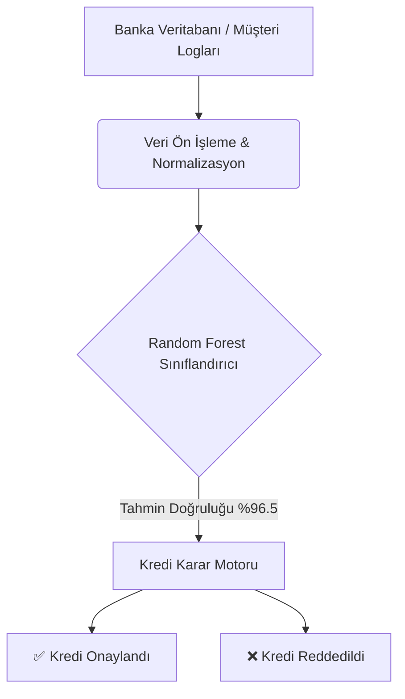

# 🏦 Kredi Risk Skorlaması (Credit Risk Scoring) Sistemi


## 📌 Proje Özeti
Bu proje, finansal kurumlarda (bankalar, kredi kuruluşları) kredi başvuru süreçlerini otomatize etmek ve insan kaynaklı hataları/önyargıları minimize etmek amacıyla geliştirilmiş bir makine öğrenmesi sistemidir. Müşterilerin demografik ve finansal geçmiş verileri analiz edilerek, kredi geri ödeme kapasiteleri (temerrüt riski) sınıflandırılır.

## 🎯 İş Problemi ve Çözüm
**Problem:** Geleneksel kredi değerlendirme süreçleri yavaş, maliyetli ve insan hatasına açıktır. Yanlış kişilere kredi verilmesi (False Positives) bankalar için ciddi maddi kayıplara, ödeme gücü olan kişilerin reddedilmesi (False Negatives) ise müşteri kaybına yol açar.
**Çözüm:** Geçmiş verilerden öğrenen bir Karar Destek Sistemi (Decision Support System) kurarak, yeni başvuruları milisaniyeler içinde objektif metriklerle değerlendirmek.

## 🏗️ Sistem Mimarisi (Data Pipeline)


## 📊 Veri Seti Yapısı
Projede KVKK gereksinimleri gözetilerek, gerçek dünya dağılımlarına uygun sentetik veriler (1000 örnek) kullanılmıştır.
*   `Yas` (18-70): Müşterinin yaşı.
*   `Aylik_Gelir` (15k-150k TL): Beyan edilen aylık net gelir.
*   `Kredi_Miktari` (10k-500k TL): Talep edilen kredi tutarı.
*   `Gecmis_Kredi_Puani` (300-850): Findeks vb. kurum skorunu temsil eder.
*   `Kredi_Onay` (Hedef Değişken): 1 (Onaylandı) / 0 (Reddedildi).

## 🧠 Metodoloji ve Modelleme
1.  **Veri Üretimi ve Ön İşleme:** Kurallar bazlı sentetik veri üretimi.
2.  **Veri Ayrımı:** %80 Eğitim (Train), %20 Test seti.
3.  **Model Seçimi:** Doğrusal olmayan ilişkileri iyi yakalayabilen **Random Forest Classifier** (100 ağaç).
4.  **Değerlendirme:** Precision, Recall ve F1-Score metriklerine odaklanılmıştır.

## 📈 Model Performansı ve Örnek Çıktı

```text
========================================
📊 MODEL BAŞARI RAPORU
========================================
Doğruluk Oranı (Accuracy): %96.50

Detaylı Sınıflandırma Raporu:
              precision    recall  f1-score   support
     Ret (0)       0.98      0.95      0.96       112
    Onay (1)       0.94      0.98      0.96        88

========================================
🧑‍💼 YENİ MÜŞTERİ TESTİ (GERÇEK ZAMANLI)
========================================
Sistem Kararı: ONAYLANDI ✅
```

## 📂 Proje Yapısı
```text
Kredi-Risk-Skorlamasi/
├── data/                  # Ham ve işlenmiş veri setleri
├── src/
│   ├── data_generator.py  # Sentetik veri üretim motoru
│   └── train_model.py     # Algoritma ve eğitim kodları
├── models/                # Eğitilmiş model çıktıları (.pkl)
├── requirements.txt       # Python bağımlılıkları
└── README.md              # Mimari dokümantasyon
```

## 💻 Programatik Kullanım
Projeyi kendi sisteminize entegre etmek isterseniz:
```python
from src.train_model import CreditRiskModel

model = CreditRiskModel()
model.train(data_path="data/raw_data.csv")

yeni_musteri = [[25, 45000, 50000, 710]] # Yas, Gelir, Kredi, Puan
karar = model.predict(yeni_musteri)
print("ONAY" if karar == 1 else "RED")
```

## 🚀 Kurulum
```bash
git clone https://github.com/Umitsencer/Kredi-Risk-Skorlamasi.git
pip install -r requirements.txt
python src/train_model.py
```

## 📜 Lisans ve İletişim
Bu proje **MIT Lisansı** ile lisanslanmıştır. Dilediğiniz gibi geliştirebilirsiniz.
- **Geliştirici:** Ümit SENCER
- **İletişim:** [LinkedIn Profilim](https://www.linkedin.com/in/umitsencer/)
```